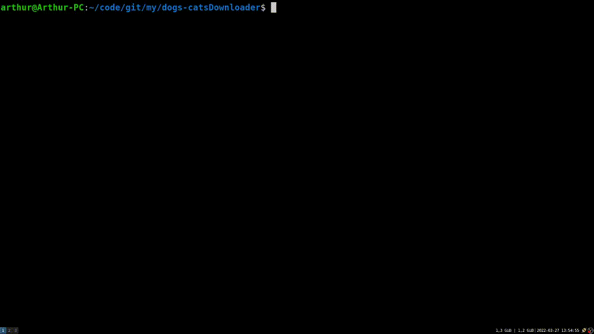

# dogsDownloader

**load.py** - *this code load .json file*

**read.py** - *just read .json and some value, 'life_span' for example.*
and

**download.py** - *download img random a dog/cat and put it in ./img*

maybe it will be useful for someone :-) 

